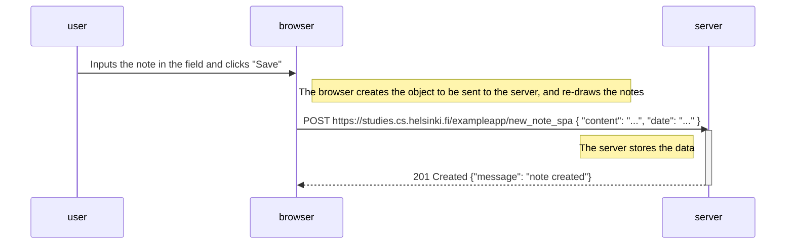

```mermaid

sequenceDiagram
    participant user
    participant browser
    participant server

    user->>browser: Inputs the note in the field and clicks "Save"

    
    Note right of browser: The browser creates the object to be sent to the server, and re-draws the notes

    browser->>server: POST https://studies.cs.helsinki.fi/exampleapp/new_note_spa { "content": "...", "date": "..." }


    activate server
    Note left of server: The server stores the data
    server-->>browser: 201 Created {"message": "note created"}
    deactivate server


```